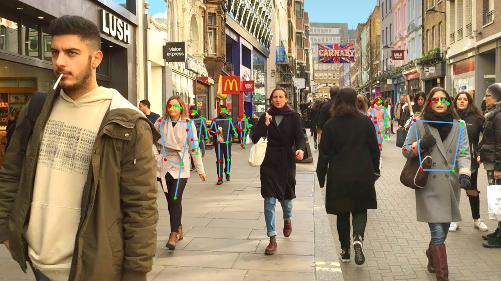

# MoveNet Multipose Tracking on OpenVINO

Running Google MoveNet Multipose models on OpenVINO.

A convolutional neural network model that runs on RGB images and predicts [human joint
locations](https://github.com/tensorflow/tfjs-models/tree/master/pose-detection#coco-keypoints-used-in-movenet-and-posenet) of several persons (6 max). 

**WIP: currently only working on CPU (not on GPU nor MYRIAD)**


*Full video demo [here.](https://youtu.be/ndy18jNcOC0)*

For MoveNet Single Pose, please visit : [openvino_movenet](https://github.com/geaxgx/openvino_movenet)


## Install

You need OpenVINO (tested on 2021.4) and OpenCV installed on your computer and to clone/download this repository.

## Run

**Usage:**

```
> python3 MovenetMPOpenvino.py -h
usage: MovenetMPOpenvino.py [-h] [-i INPUT] [--xml XML]
                            [-r {192x192,192x256,256x256,256x320,320x320,480x640,736x1280}]
                            [-t {iou,oks}] [-s SCORE_THRESHOLD] [-o OUTPUT]

optional arguments:
  -h, --help            show this help message and exit
  -i INPUT, --input INPUT
                        Path to video or image file to use as input
                        (default=0)
  --xml XML             Path to an .xml file for model
  -r {192x192,192x256,256x256,256x320,320x320,480x640,736x1280}, --res {192x192,192x256,256x256,256x320,320x320,480x640,736x1280}
  -t {iou,oks}, --tracking {iou,oks}
                        Enable tracking and specify method
  -s SCORE_THRESHOLD, --score_threshold SCORE_THRESHOLD
                        Confidence score (default=0.200000)
  -o OUTPUT, --output OUTPUT
                        Path to output video file
```

**Examples :**

- To use default webcam camera as input :

    ```python3 MovenetMPOpenvino.py```

- To specify the model input resolution :

    ```python3 MovenetMPOpenvino.py -r 256x320```

- To enable tracking, based on Object Keypoint Similarity :

    ```python3 MovenetMPOpenvino.py -t keypoint```

- To use a file (video or image) as input :

    ```python3 MovenetMPOpenvino.py -i filename```


|Keypress|Function|
|-|-|
|*Esc*|Exit|
|*space*|Pause
|b|Show/hide bounding boxes|
|f|Show/hide FPS|


## Input resolution

The model input resolution (set with the '-r' or '--res' option) has an impact on the inference speed (the higher the resolution, the slower the inference) and on the size of the people that can be detected (the higher the resoltion, the smaller the size).
The test below has been run on a CPU i7700k.


|Resolution|FPS |Result|
|-|-|-|
|192x256|58.0|[](img/street_192x256.jpg)|
|256x320|44.1|[](img/street_256x320.jpg)|
|480x640|14.8|[](img/street_480x640.jpg)|
|736x1280|4.5|[](img/street_736x1280.jpg)|

## Tracking

The Javascript MoveNet demo code from Google proposes as an option [two methods of tracking](https://github.com/tensorflow/tfjs-models/blob/master/pose-detection/src/calculators/tracker.md). For this repository, I have adapted this tracking code in python. You can enable the tracking with the `--tracking` (or `-t`) argument of the demo followed by `iou` or `oks` which specifies how to calculate the similarity between detections from consecutive frames :
* IoU (Intersection over Union) of pose bounding boxes (option `iou`);
* [Object Keypoint Similarity](https://cocodataset.org/#keypoints-eval) (option `oks`).

|Tracking|Result|
|-|-|
|IoU Tracking||
|OKS Tracking||

In the example above, we can notice several track switching in the IoU output and a track replacement (2 by 6). OKS method is doing a better job, yet it is not perfect: there is a track switching when body 3 is passing in front of body 1. 


## The models 
The MoveNet Multipose v1 source model comes from the Tensorfow Hub: https://tfhub.dev/google/movenet/multipose/lightning/1

The model was converted by PINTO in OpenVINO IR format. Unfortunately, the OpenVINO IR MoveNet model input resolution cannot be changed dynamically, so an arbitrary list of models have been generated, each one with its dedicated input resolution. These models and others (other resolutions or precisions) are also available there: https://github.com/PINTO0309/PINTO_model_zoo/tree/main/137_MoveNet_MultiPose


## Credits
* [Google Tensorflow Hub](https://tfhub.dev/google/movenet/multipose/lightning/1)
* Katsuya Hyodo a.k.a [Pinto](https://github.com/PINTO0309), the Wizard of Model Conversion !
* The original video : [The Evolution of Dance - 1950 to 2019 - By Ricardo Walker's Crew](https://www.youtube.com/watch?v=p-rSdt0aFuw&ab_channel=RicardoWalker)
